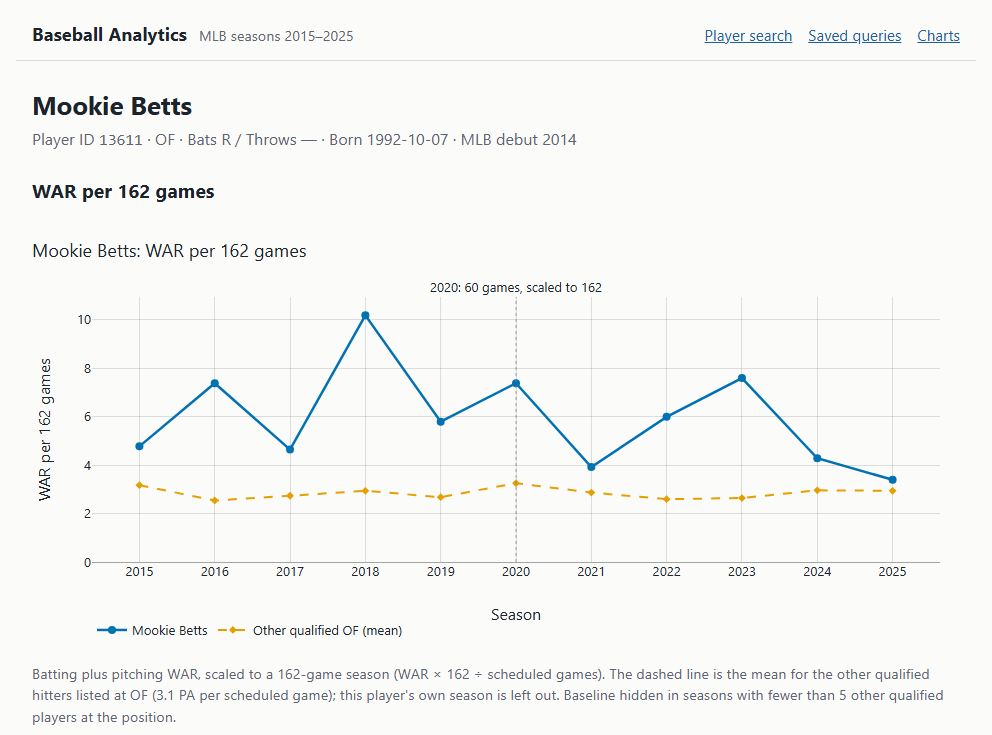
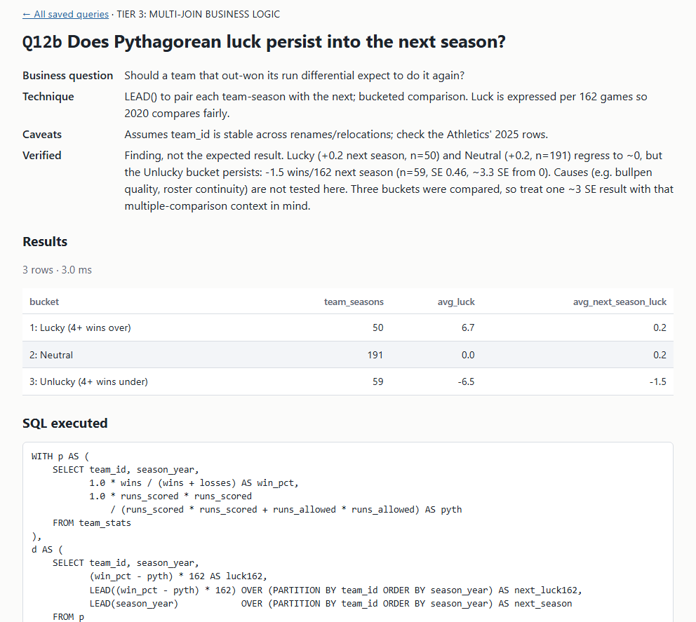
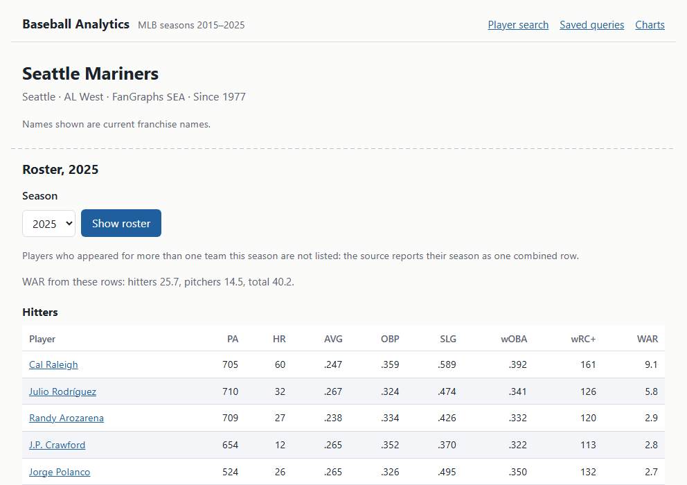
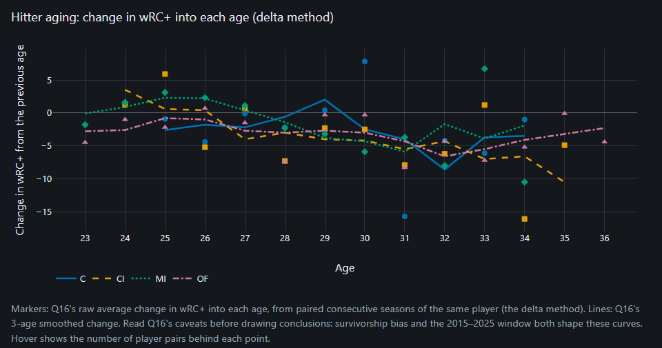
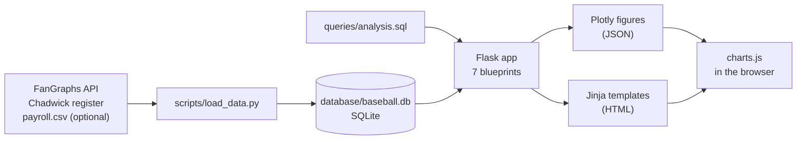

# Baseball Analytics Database

A SQLite database of MLB season statistics for 2015–2025, an analytics layer of 20 SQL queries, each checked against real baseball facts, and a Flask app that serves the queries, player and team pages, and Plotly charts. It is the course project for LSU CSC 4402 (Database Systems).

## Screenshots

<table>
  <tr>
    <td width="50%"><a href="docs/screenshots/02-player-war-chart.png"></a><br><sub>Player WAR per 162 games vs. other qualified players at the position</sub></td>
    <td width="50%"><a href="docs/screenshots/05-saved-query-sql.png"></a><br><sub>A saved query with its caveats, results and the exact SQL that ran</sub></td>
  </tr>
  <tr>
    <td width="50%"><a href="docs/screenshots/07-team-roster.png"></a><br><sub>Team page with a season roster (seasons table cropped out)</sub></td>
    <td width="50%"><a href="docs/screenshots/08-dark-mode-chart.png"></a><br><sub>Aging curves by position group (Q16), dark mode</sub></td>
  </tr>
</table>

Data: FanGraphs (season statistics), Chadwick Bureau (player register). Local demo; not deployed.

More screenshots: [docs/screenshots/](docs/screenshots/).

## Features

- **Player search** by name, accent-insensitive, with player IDs shown because some names belong to two players.
- **Player pages:** season-by-season batting and pitching, and a chart of WAR per 162 games against the mean of other qualified players at the same position.
- **Season pages** with the full stat line and league ranks among qualified hitters.
- **Compare** two players on one WAR chart.
- **Saved queries:** all 21 query blocks from `queries/analysis.sql`, each with its business question, technique, caveats, results, the exact SQL that ran, and a season filter where the output has a season column.
- **Charts** built from saved-query output: wOBA leaderboard (Q01), payroll vs. win % (Q03), birth-cohort WAR (Q10), and aging curves (Q16).
- **Team pages** with season results and single-team rosters.
- **Player notes:** create, edit and delete notes on a player (the app's one write path).
- Light and dark mode, following the system setting.

## Architecture



The loader downloads the source data, builds the database in a temporary file, validates it, and swaps it in. The Flask app is an app factory with 7 blueprints (search, players, compare, notes, saved queries, teams, chart assets); pages read through a read-only connection, and saved queries run the SQL parsed from `queries/analysis.sql` at startup. Charts are built in Python with Plotly and fetched by the page as JSON; `plotly.min.js` is served from the installed package, not a CDN.

## Database design

The schema has 8 relations in BCNF: 7 hold loaded data (players, teams, divisions, seasons, batting, pitching and team season stats) and 1 holds notes written in the app. `divisions` is split out of `teams` to remove a transitive dependency, innings are stored as outs, and every rate that can be computed from its own row (AVG, OBP, SLG, ERA, win %) is a generated column, while context-dependent metrics like WAR and wRC+ are stored. Relations, keys, row counts and design decisions: [SCHEMA.md](SCHEMA.md).

## Analytics

The 20 queries (21 blocks, since Q12 has two parts) are grouped into four tiers, from joins and aggregation through window functions and multi-join business logic to CTE pipelines for modeling-style questions. Each query has a header with its business question, technique, caveats and a `Verified:` line naming a real-world fact checked against its output. Overview and highlights: [QUERIES.md](QUERIES.md).

## Key findings

Each number comes from the named query, run against the current database. The caveats come from the query's own header.

| Finding | Number | Query |
| --- | --- | --- |
| Teams that won 4+ games fewer than their run differential predicted (per 162) were still below it the next season on average. Teams that won 4+ more regressed to about zero. Causes are not tested, and this is one of three buckets compared. | Unlucky: −6.5 → −1.5 wins/162 next season (n = 59, SE 0.46). Lucky: +6.7 → +0.2 (n = 50). | Q12b |
| Among hitters with a 100–119 wRC+ season, those who changed teams the next season dropped more than those who stayed. Movers are not a random sample, and only single-team seasons are compared. | −6.7 vs. −1.7 wRC+ (n = 80 vs. 483) | Q13 |
| On the smoothed delta-method aging curve, middle infielders peak at 27 and corner infielders at 26. Catchers and outfielders show no rise after their first qualifying age, likely a selection effect, so no peak age is claimed for them. Offense only. | MI +5.7 wRC+ at 27; CI +4.6 at 26 (cumulative, smoothed) | Q16 |
| Shortstops produced the most WAR per 600 PA over the window, first basemen the least. WAR includes a positional adjustment, so this reflects where talent was concentrated in these years, not the value of the position. | SS 2.60 vs. 1B 1.61 WAR per 600 PA (mean of 11 seasons) | Q14 |
| The 1992 birth cohort produced the most WAR in the window. Its players were 23–33 during 2015–2025, so the window caught them at peak age; older and younger cohorts are truncated. | 904.9 WAR (246 players) | Q10 |
| Aaron Judge had the top qualified wOBA in 3 of the 11 seasons. His 2024 mark is the highest by a season leader in a 162-game season (Juan Soto's .478 came in the 60-game 2020 season). | 2022, 2024, 2025; .476 in 2024 | Q01 |

## Security

The app is a local demo, but it handles user input on every page and writes to the database, so it has these controls:

| Control | How it's enforced | Tested by |
| --- | --- | --- |
| Read-only connection | Every page read uses a connection opened with `mode=ro`. GET routes never open the read-write connection. | `test_ro_connection_rejects_writes`, `test_get_routes_never_open_the_rw_connection` |
| Authorizer on the only write path | Note writes use a separate read-write connection with a `sqlite3` authorizer that denies by default and allows `INSERT`/`UPDATE`/`DELETE` only on `player_notes`. DDL, `ATTACH`, `PRAGMA` and writes to other tables are refused by SQLite. | `test_rw_authorizer_denies_everything_but_note_writes` (10 statements) |
| Whitelisted saved queries | Saved queries are a server-side registry keyed by slug; an unknown slug is a 404, and no SQL is ever taken from a request. The app refuses to start if `analysis.sql` and the registry disagree. | `test_unknown_slug_is_404`, `test_missing_registry_entry_raises`, `test_extra_registry_entry_raises`, `test_execute_only_ever_receives_registry_sql` |
| Parameterized SQL | All request values are bound as parameters, including the name-search `LIKE` pattern (escaped in Python, bound with `ESCAPE`). An AST check fails if any `execute` call in `app/` passes SQL that isn't a string literal, a module constant or a `+` of those; the one allowed exception runs registry SQL. | `tests/test_static_sql.py` |
| CSRF | Flask-WTF protects every POST. A sweep finds every POST route from the URL map and checks that a missing or forged token gets a 400 and saves nothing. | `test_every_post_route_requires_csrf`, `test_csrf_is_not_disabled_or_exempted` |
| Strict Content Security Policy | `script-src 'self'; style-src 'self'`, with no `unsafe-inline` or `unsafe-eval`. Templates have no inline scripts, styles or `style=` attributes; Plotly's CSS is served as a file. Jinja autoescaping stays on, and front-end JS has no `innerHTML` or `eval`. | `test_csp_is_strict`, `test_templates_have_no_inline_script_style_or_safe`, `test_js_has_no_html_or_eval_sinks` |
| Integer bounds | Route fuzzing sends bad values, including integers above SQLite's 64-bit limit, to every path and query parameter. Out-of-range path ids are a 404 without querying; bad query-string ids and seasons are a 400. | `tests/test_fuzz_routes.py` |
| Request size limit | `MAX_CONTENT_LENGTH` is 16 KB; a larger request gets a 413 and saves nothing. | `test_max_content_length_is_16kb`, `test_oversized_post_is_413_and_saves_nothing` |
| Atomic loader | The rebuild happens in a temporary file and is swapped in only after validation; a failure leaves the old database, notes included, byte-identical. | `test_failure_mid_load_leaves_original_byte_identical`, `test_validation_failure_does_not_swap` |

## Testing

```sh
pytest
```

441 tests, about a minute. They run against a small fictional database built from `design/schema.sql`, so they don't need the real one; the 2 tests that check the real database are skipped when it hasn't been built. The suite covers the saved-query parser and every query's row count, the charts and their data, player, season, compare and team pages, search, the notes CRUD flow, the loader's atomic rebuild and note carry-over, and the security controls above, including route fuzzing and the static SQL check.

## Setup

About 5 minutes on a fresh clone, most of it downloading packages and data.

```sh
py -3.14 -m venv venv; venv\Scripts\Activate.ps1   # macOS/Linux: python3 -m venv venv; source venv/bin/activate
pip install -r requirements.txt
python scripts/load_data.py --refresh
flask --app app run                                # then open http://127.0.0.1:5000
```

Step-by-step instructions for Windows and macOS/Linux, optional payroll, tests and troubleshooting: [SETUP.md](SETUP.md).

## Data, credits and limitations

- **FanGraphs** ([fangraphs.com](https://www.fangraphs.com)): player and team season statistics, fetched from FanGraphs' API when you build the database. Running the loader with `--refresh` fetches data from FanGraphs' API, and users are responsible for complying with FanGraphs' terms of service.
- **Chadwick Baseball Bureau Register** ([github.com/chadwickbureau/register](https://github.com/chadwickbureau/register)): player names, birth dates and cross-site IDs. Contains information from the Chadwick Baseball Bureau Register, which is made available under the [Open Data Commons Attribution License (ODC-By 1.0)](https://opendatacommons.org/licenses/by/1-0/).
- **Payroll is optional and hand-built** from Spotrac and Cot's Contracts. Without it, the payroll features show a "not loaded" panel.
- **No source data is in this repository.** The loader downloads it; see [database/README.md](database/README.md).

Limitations:

- The 2015–2025 window truncates careers: older players are missing their early seasons and younger players their late ones, which affects every career, streak and cohort result.
- A player traded mid-season has one combined season row, so pre- and post-trade splits aren't possible and team-level queries exclude those rows.
- There are no individual salaries, only team payroll.
- There is no Statcast, pitch-level, tracking or game-level data.

## Author

\<name\> · \<LinkedIn\> · \<email\>
