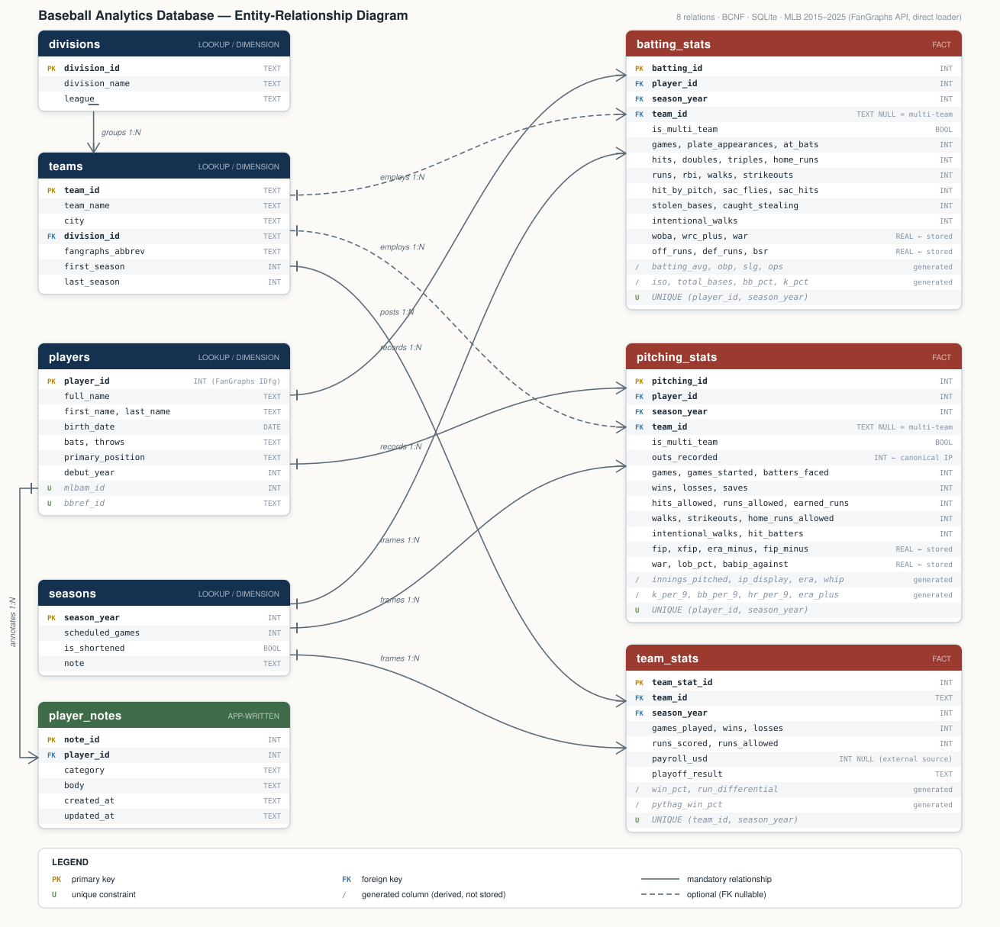

# Schema

The database is one SQLite file with 8 relations, all in BCNF. Seven hold loaded data: MLB player batting and pitching seasons, team results and payroll, players, teams, divisions and seasons, covering 2015–2025. The eighth, `player_notes`, holds notes that users write through the app. The DDL is [design/schema.sql](design/schema.sql). The full design rationale, including functional dependencies for every relation and the documented exceptions, is in [design/schema-notes.md](design/schema-notes.md).

## Relations

| Relation | Purpose | Grain | Primary key | Rows |
| --- | --- | --- | --- | --- |
| `divisions` | League and division names | one row per division | `division_id` | 6 |
| `teams` | Franchises and their division | one row per franchise | `team_id` | 30 |
| `seasons` | Season year and scheduled games (60 in 2020) | one row per season | `season_year` | 11 |
| `players` | Names, birth date, handedness, position, cross-site IDs | one row per player | `player_id` | 4,019 |
| `batting_stats` | Season batting lines and value metrics | one row per player per season, `UNIQUE (player_id, season_year)` | `batting_id` | 15,521 |
| `pitching_stats` | Season pitching lines and value metrics | one row per player per season, `UNIQUE (player_id, season_year)` | `pitching_id` | 8,968 |
| `team_stats` | Team wins, losses, runs, and payroll (optional) | one row per team per season, `UNIQUE (team_id, season_year)` | `team_stat_id` | 330 |
| `player_notes` | Notes written in the app (the CRUD table) | one row per note | `note_id` | app-written, not counted |

`batting_stats` includes 6,348 rows with 0 plate appearances, 6,332 of them for players who pitched that season. Hitter queries use the view `v_batting_season` (9,173 rows), which drops them.

## E-R diagram

## Design decisions

- **`divisions` is split from `teams`.** Keeping league and division on `teams` would create the transitive dependency `team_id → division → league`, a 3NF violation. ([§2](design/schema-notes.md#2-normalization-analysis))
- **Innings are stored as `outs_recorded`.** The `186.2` display notation is base 3 and breaks arithmetic, so innings and their display form are generated from outs. ([§3.1](design/schema-notes.md#31-innings-pitched-are-stored-as-outs-never-as-1801))
- **Rates derivable from the same row are generated columns; context-dependent metrics are stored.** AVG, OBP, SLG, ERA, WHIP and win% can't drift from their inputs, while WAR, wOBA, wRC+ and FIP depend on league-wide data the database doesn't hold. ([§3.2](design/schema-notes.md#32-derived-rates-are-generated-columns-context-dependent-metrics-are-stored))
- **One row per player per season, and multi-team seasons are one combined row.** The source reports a traded player's season already combined, so that row has `team_id IS NULL` and `is_multi_team = 1`, and queries by team exclude it. ([§1](design/schema-notes.md#1-grain))
- **`player_notes` references `players` with `ON DELETE RESTRICT`.** Stat rows can be downloaded again but notes cannot, so a player with notes can't be deleted until the notes are dealt with. ([§3.11](design/schema-notes.md#311-player_notes-the-one-relation-the-app-writes))
- **Rebuilds are atomic.** The loader builds a complete new database in a temporary file, restores existing notes into it, and swaps it in only after validation passes, so a failed rebuild leaves the old database untouched. ([§3.11](design/schema-notes.md#311-player_notes-the-one-relation-the-app-writes))
